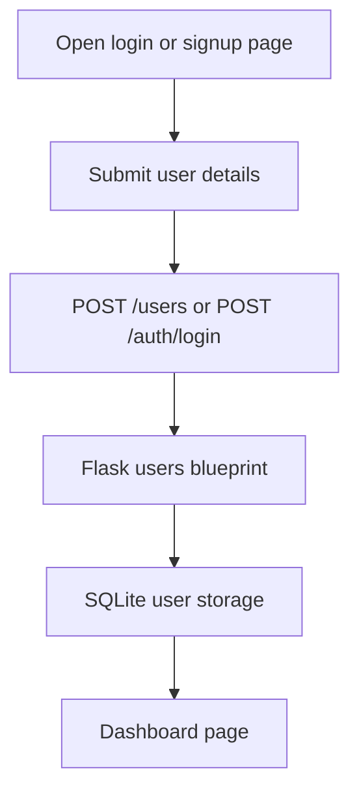
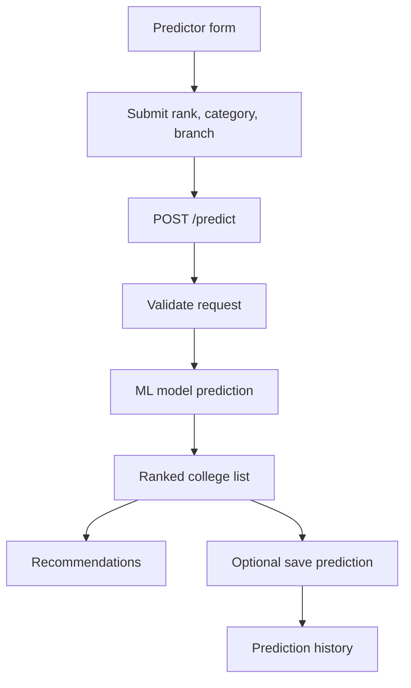
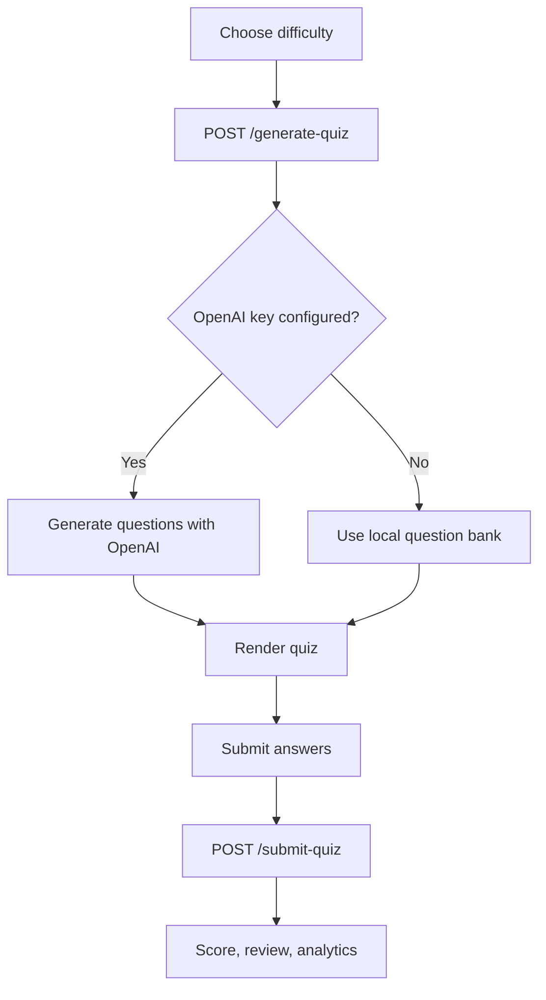
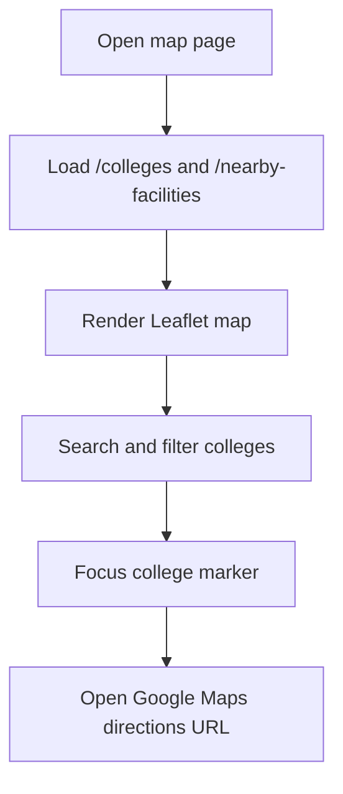
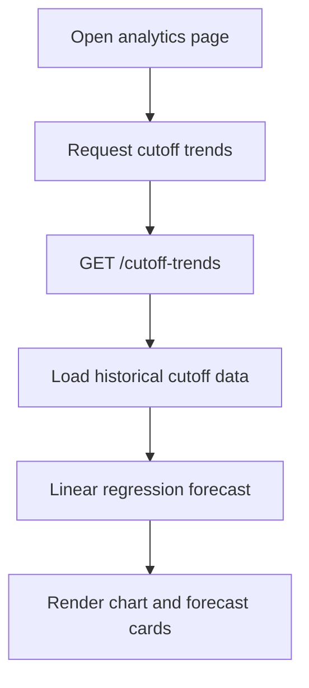

<<<<<<< HEAD
# RankRoute

RankRoute is a Flask-based KCET college predictor with machine learning predictions, cutoff analytics, personalized recommendations, mock tests, and a static frontend served by the same backend.

## What The App Does

- Predicts possible colleges from KCET rank, category, and branch.
- Ranks multiple college options with chance and confidence values.
- Saves and manages user prediction history.
- Generates mock tests with local question-bank fallback and optional AI generation.
- Scores quiz submissions with review data, analytics, and leaderboard support.
- Shows cutoff trends and next-year cutoff forecasts.
- Serves a browser-based frontend for login, dashboard, predictor, map, analytics, comparison, and mock test flows.

## Technologies Used

### Backend

- Python 3
- Flask for the web server and routing
- Flask-CORS for cross-origin requests between the frontend and backend
- SQLite for local storage
- bcrypt and Werkzeug security helpers for password hashing and verification

### Data And Machine Learning

- pandas for dataset handling
- numpy for numeric operations
- scikit-learn for model training and analytics forecasting
- joblib for saving and loading trained model artifacts
- requests for outbound HTTP calls during AI quiz generation

### Frontend

- HTML, CSS, and JavaScript
- Bootstrap for layout and components
- Bootstrap Icons for iconography
- Leaflet and Leaflet marker clustering for the map explorer
- Chart.js for charts on analytics and mock test pages
- Google Fonts for typography

### Deployment And Runtime

- Waitress for LAN/server-style production launching
- PowerShell and batch scripts for Windows startup helpers

## Tech Stack

- Backend: Flask, Flask-CORS
- ML / data: scikit-learn, pandas, numpy, joblib
- Auth: bcrypt
- Database: SQLite
- Optional server: Waitress for LAN deployment
- Optional AI: OpenAI Chat Completions API
- Frontend: static HTML, CSS, and JavaScript

## APIs Used

### Internal Project APIs

- `GET /api/health` - service health
- `POST /predict` - generate college predictions
- `GET /colleges` - return college catalog data
- `GET /nearby-facilities` - return supporting facility data
- `GET /cutoff-trends` - return historical cutoff trends and forecast
- `GET /cutoff-forecast` - return forecast-only cutoff data
- `POST /users` - create a user account
- `POST /auth/login` - authenticate a user
- `GET /users/<user_id>` - fetch a user profile
- `PUT /users/<user_id>` - update a user profile
- `DELETE /users/<user_id>` - delete a user profile
- `POST /predictions` - save a prediction
- `GET /predictions/<prediction_id>` - fetch a saved prediction
- `PUT /predictions/<prediction_id>` - update a saved prediction
- `DELETE /predictions/<prediction_id>` - delete a saved prediction
- `GET /users/<user_id>/predictions` - list a user’s saved predictions
- `POST /generate-quiz` - generate mock test questions
- `POST /submit-quiz` - score a quiz submission
- `GET /quiz-history` - return past quiz attempts
- `GET /quiz-analytics` - return quiz analytics
- `POST /submit-score` - save score data
- `GET /leaderboard` - return leaderboard data

### External APIs And Services

- OpenAI Chat Completions API - used only when `OPENAI_API_KEY` is set and AI mock test is enabled
- Google Maps directions URLs - used by the map explorer for navigation; no Google Maps API key is consumed by the code
- CDN-hosted assets - Bootstrap, Bootstrap Icons, Leaflet, Leaflet marker cluster, Chart.js, and Google Fonts

## Project Structure

```text
backend/
	app.py
	data/
		college_cutoffs.json
		college_locations.json
		dataset.csv
		nearby_facilities.json
		questions.json
	database/
		db.py
		schema.sql
		seed.sql
	model/
		train_model.py
	routes/
		analytics.py
		colleges.py
		mocktest.py
		predict.py
		predictions.py
		users.py
	services/
		college_service.py
		ml_model_service.py
		prediction_service.py
		recommendation_service.py
		user_service.py
	utils/
		data_loader.py
		ml_placeholder.py
		validators.py
frontend/
	css/
		map.css
		style.css
	data/
		all_colleges.json
		colleges.json
	html/
		analytics.html
		comparison.html
		crashcourse.html
		dashboard.html
		index.html
		login.html
		map.html
		mocktest.html
		notifications.html
		predictorpage.html
		signup.html
	js/
		map.js
		mocktest.js
		script.js
```

## Main Features
RankRoute is an e-learning and career guidance platform designed for PU (Pre-University) students. It provides study materials, mock tests, and personalized learning resources to help students prepare for competitive exams. The platform connects students with colleges, coaching institutes, and educational opportunities through a centralized joining portal. It also offers performance tracking and progress analysis to improve learning outcomes. RankRoute aims to simplify exam preparation and support students in making informed academic and career decisions.
### College Prediction

- `POST /predict`
- Uses rank, category, and branch to generate a primary prediction plus ranked alternatives.
- Includes confidence, chance labels, recommendations, and optional persistence for logged-in users.

### Prediction History

- `POST /predictions`
- `GET /predictions/<prediction_id>`
- `PUT /predictions/<prediction_id>`
- `DELETE /predictions/<prediction_id>`
- `GET /users/<user_id>/predictions`

### Authentication and Users

- `POST /users`
- `POST /auth/login`
- `GET /users/<user_id>`
- `PUT /users/<user_id>`
- `DELETE /users/<user_id>`

### College and Map Data

- `GET /colleges`
- `GET /nearby-facilities`
- Powers the college catalog and map explorer.

### Analytics and Forecasting

- `GET /cutoff-trends`
- `GET /cutoff-forecast`
- Uses historical cutoff data and linear regression for next-year estimates.

### Mock Tests

- `POST /generate-quiz`
- `POST /submit-quiz`
- `GET /quiz-history`
- `GET /quiz-analytics`
- `POST /submit-score`
- `GET /leaderboard`
- Backward-compatible aliases are also available: `POST /generate-test`, `POST /submit-test`

## Flow Charts

### Authentication And Dashboard



### College Prediction Flow



### Mock Test Flow



### Map Explorer Flow



### Analytics Flow



## Frontend Pages

The backend serves the following pages directly:

- `/` -> `frontend/html/index.html`
- `/login` -> `frontend/html/login.html`
- `/signup` -> `frontend/html/signup.html`
- `/dashboard` -> `frontend/html/dashboard.html`
- `/predictor` -> `frontend/html/predictorpage.html`
- `/map` -> `frontend/html/map.html`
- `/mocktest` -> `frontend/html/mocktest.html`
- `/notifications` -> `frontend/html/notifications.html`
- `/crashcourse` -> `frontend/html/crashcourse.html`
- `/analytics` -> `frontend/html/analytics.html`
- `/comparison` -> `frontend/html/comparison.html`

## Setup

### 1. Install Dependencies

```bash
python -m pip install -r requirements.txt
```

### 2. Train The Prediction Model

```bash
python backend/model/train_model.py
```

This generates the model artifacts used by the prediction pipeline.

### 3. Start The Backend

```bash
python backend/app.py
```

The app runs on `http://127.0.0.1:5000/` by default.

## Windows LAN Startup

If PowerShell blocks script execution, use a temporary bypass for the current session:

```powershell
Set-ExecutionPolicy -Scope Process -ExecutionPolicy Bypass
.\run_lan_server.ps1
```

You can also launch the LAN server with:

```powershell
powershell -NoProfile -ExecutionPolicy Bypass -File .\run_lan_server.ps1
```

For a double-click friendly option, run `run_lan_server.bat`. It starts the server with a temporary bypass and opens the browser automatically.

## External APIs And Keys

- `OPENAI_API_KEY`: optional, used only for AI-generated mock tests in `backend/routes/mocktest.py`.
- Google Maps API key: not currently consumed by code. The map page opens Google Maps directions URLs without reading a key from environment or localStorage.
- CDN assets: the frontend loads Leaflet, Bootstrap Icons, Leaflet marker clustering, Google Fonts, and Chart.js resources without API keys.

## API Examples

### Predict Colleges

```text
POST /predict
=======
# RankRoute – AI-Based KCET College Predictor

## Overview

RankRoute is an AI-powered student guidance platform designed to help engineering aspirants make smarter admission decisions during KCET counseling. The platform combines machine learning, interactive college maps, analytics, mock tests, and personalized recommendations to provide a complete counseling assistance system.

The project goes beyond a traditional college predictor by integrating:

* AI-based college prediction
* Interactive Karnataka engineering college map explorer
* Nearby facilities and navigation support
* AI-generated mock tests
* Cutoff analytics and forecasting
* Personalized college recommendations

---

# Features

## 🎯 AI-Based College Prediction

* ML-powered `/predict` API endpoint
* Predicts colleges based on:

  * KCET rank
  * Category
  * Preferred branch
* Displays:

  * Predicted colleges
  * Confidence score
  * Admission chance
  * Personalized recommendations

---

## 🗺️ College Map Explorer

* Interactive map showing engineering colleges across Karnataka
* Built using Leaflet.js and OpenStreetMap
* Displays:

  * College locations
  * Distance from user
  * Nearby facilities
  * NIRF rankings
  * Directions support

---

## 🧠 AI / Local Mock Test Generator

* Generates mock tests dynamically
* Supports:

  * AI-generated questions
  * Local fallback question bank
* Includes:

  * Timer-based auto submission
  * Instant result analysis
  * Answer review system

---

## 📊 Analytics & Cutoff Forecasting

* Displays previous cutoff trends
* Forecasts next-year cutoff using regression analysis
* Helps students analyze admission possibilities more effectively

---

## 🔔 Official Notifications System

* Dedicated notifications page for:

  * KCET updates
  * COMEDK notifications
  * PESSAT updates
  * Counseling schedules
  * Admission alerts

---

# Project Structure

```text
backend/
│
├── app.py
├── data/
│   ├── dataset.csv
│   ├── questions.json
│   ├── college_cutoffs.json
│   └── nearby_facilities.json
│
├── model/
│   ├── train_model.py
│   ├── model.pkl
│   └── encoder.pkl
│
├── routes/
│   ├── predict.py
│   ├── mocktest.py
│   ├── analytics.py
│   └── users.py
│
├── services/
│   ├── ml_model_service.py
│   ├── recommendation_service.py
│   ├── prediction_service.py
│   └── user_service.py
│
frontend/
│
├── html/
│   ├── dashboard.html
│   ├── predictorpage.html
│   ├── map.html
│   ├── notifications.html
│   ├── mocktest.html
│   ├── crashcourse.html
│   └── aboutproject.html
│
├── css/
│   └── style.css
│
└── js/
    ├── script.js
    └── map.js
```

---

# How the ML Model Works

## Input Features

The prediction model uses:

* KCET Rank
* Student Category
* Preferred Branch

---

## Category Encoding

| Category | Encoded Value |
| -------- | ------------- |
| GM       | 0             |
| OBC      | 1             |
| SC/ST    | 2             |

---

## Branch Encoding

| Branch | Encoded Value |
| ------ | ------------- |
| CSE    | 0             |
| ISE    | 1             |
| ECE    | 2             |
| AIML   | 3             |

---

## ML Algorithm

Default model:

* RandomForestClassifier

Optional models:

* DecisionTreeClassifier
* LogisticRegression

---

## Output

The model predicts:

* College name
* Confidence score
* Admission probability
* Recommendation insights

---

# Technologies Used

## Frontend

* HTML
* CSS
* JavaScript

## Backend

* Python
* Flask

## Database

* SQLite

## Maps & Navigation

* Leaflet.js
* OpenStreetMap
* Google Maps Directions

## AI / ML

* Scikit-learn
* Random Forest Classifier
* Regression Forecasting

---

# Setup Instructions

## Install Dependencies

```bash
pip install -r requirements.txt
```

## Train the ML Model

```bash
python backend/model/train_model.py
```

## Run Backend Server

```bash
python backend/app.py
```

---

# Windows Startup Without PowerShell Errors

PowerShell blocks `.ps1` files by default for security reasons.

Use temporary bypass:

```powershell
Set-ExecutionPolicy -Scope Process -ExecutionPolicy Bypass
```

Then run:

```powershell
.\run_lan_server.ps1
```

---

## One-Line Safe Launch

```powershell
Set-ExecutionPolicy -Scope Process -ExecutionPolicy Bypass; Start-Process "http://127.0.0.1:5000"; python backend/app.py
```

---

# API Endpoints

## 🎯 Predict Colleges

### POST `/predict`

### Request

```json
>>>>>>> 0a1a7dd91876611223ded7300a7ee1e095853534
{
  "rank": 3200,
  "category": "GM",
  "branch": "CSE",
  "previous_test_scores": [72, 84, 79]
}
```

<<<<<<< HEAD
Response includes the primary model prediction, a ranked `predictions` list, and `recommendations`.

### Cutoff Trends

```text
GET /cutoff-trends?category=GM&branch=CSE
GET /cutoff-forecast?category=GM&branch=CSE
```

### Mock Test Generation

```text
POST /generate-quiz
{
	"difficulty": "medium"
}
```

If OpenAI is not configured or fails, the app falls back to the local question bank.

### Mock Test Submission

```text
POST /submit-quiz
{
	"quiz_id": "<id>",
	"answers": [
		{"question_id": 0, "selected_index": 2},
		{"question_id": 1, "selected_index": 0}
	],
	"time_taken_seconds": 420
}
```

### College Catalog

```text
GET /colleges
GET /nearby-facilities
```

## Data And Storage

- SQLite stores users and prediction history.
- `backend/data/dataset.csv` powers the training workflow.
- `backend/data/questions.json` provides the local mock test bank.
- `backend/data/college_cutoffs.json` and related JSON files power cutoff and map views.

## Notes

- Train the model before using `/predict`.
- `backend/model/model.pkl` and `backend/model/encoder.pkl` are generated artifacts used for inference.
- The app includes a health check at `GET /api/health`.
- Legacy `/html/<page>` routes redirect to the cleaner page URLs.
=======
### Response

* Predicted colleges
* Confidence score
* Recommendations
* Admission chance

---

## 🧪 Generate Mock Test

### POST `/generate-test`

```json
{
  "subject": "physics",
  "difficulty": "medium",
  "use_ai": true
}
```

If AI generation fails, the local question bank is used automatically.

---

## ✅ Submit Mock Test

### POST `/submit-test`

```json
{
  "test_id": "<id>",
  "answers": [
    {
      "id": 0,
      "selected_option": "velocity-time"
    }
  ]
}
```

### Returns

* Score
* Percentage
* Correct/Wrong count
* Detailed answer review

---

## 📈 Analytics Forecast

### GET Endpoints

```http
/cutoff-trends?category=GM&branch=CSE

/cutoff-forecast?category=GM&branch=CSE
```

---

## 🗺️ College Map Data

### GET `/colleges`

Returns:

* College names
* Coordinates
* Branches
* Cutoff information
* Nearby facilities

---

# Security & Optimization

The project includes:

* Password hashing
* Secure login handling
* Indexed database optimization
* Efficient data retrieval
* Responsive architecture
* Smooth UI performance optimization

-----

# Future Enhancements

Planned upgrades:

* AI chatbot counselor
* Real-time notifications
* Mobile application
* Cloud deployment
* Personalized AI recommendations
* Advanced analytics dashboard

---

# Project Benefits and Stakeholder Impact:

* 👨‍🎓 Students:

Can easily report issues without searching for the right department.
Get transparency through status tracking and resolution updates.

* 👨‍💼 College Administration: 

Receives all campus issues in one centralized dashboard.
Can prioritize and assign issues efficiently instead of relying on emails or verbal complaints.

------
# Final Objective

RankRoute aims to become a complete AI-powered student counseling and guidance platform that helps engineering aspirants:

* Predict colleges
* Analyze admission chances
* Explore campuses
* Navigate locations
* Prepare for exams
* Make smarter career decisions
>>>>>>> 0a1a7dd91876611223ded7300a7ee1e095853534
